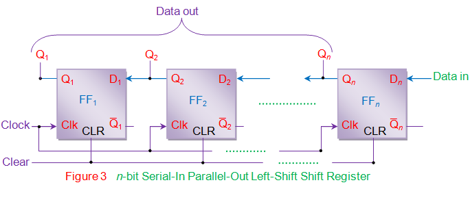

### Introduction

In Serial In Parallel Out (SIPO) shift registers, the data is stored into the register serially while it is retrieved from it in parallel-fashion. Figure 1 shows an n-bit synchronous SIPO shift register sensitive to positive edge of the clock pulse. Here the data word which is to be stored (Data in) is fed serially at the input of the first flip-flop (D1 of FF1). It is also seen that the inputs of all other flip-flops (except the first flip-flop FF1) are driven by the outputs of the preceding ones like the input of FF2 is driven by the output of FF1. In this kind of shift register, the data stored within the register is obtained as a parallel-output data word (Data out) at the individual output pins of the flip-flops (Q1 to Qn). 

 
  

In general, the register contents are cleared by applying high on the clear pins of all the flip-flops at the initial stage. After this, the first bit, B1 of the input data word is fed at the D1 pin of FF1.This bit (B1) will enter into FF1, get stored and thereby appears at its output Q1 on the appearance of first leading edge of the clock. Further at the second clock pulse, the bit B1 right-shifts and gets stored into FF2 while appearing at its output pin Q2 while a new bit, B2 enters into FF1. Similarly at each clock pulse the data within the register moves towards right by a single bit while a new bit of the input word enters into the register. Meanwhile one can extract the bits stored within the register in parallel-fashion at the individual flip-flop outputs. 

Analyzing on the same grounds, one can note that the n-bit input data word is obtained as an n-bit output data word from the shift register at the rising edge of the nth clock pulse. This working of the shift-register can be summarized as in Table I and the corresponding waveforms are given by figure 2.  

  

  
      
In the right-shift SIPO shift-register, data bits shift from left to right for each clock pulse. However if the data bits are made to shift from right to left in the same design, one gets a left-shift SIPO shift-register as shown by figure 3. Nevertheless the basic working principle remains the same except the fact that now Bn down to B1 is stored in Qn down to Q1 i.e. Q1 = B1, Q2 = B2 … Qn = Bn at the nth clock pulse. 

 

      

